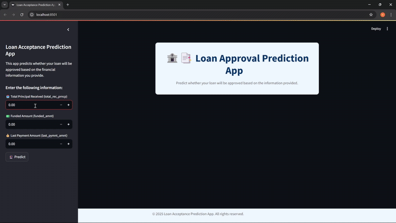
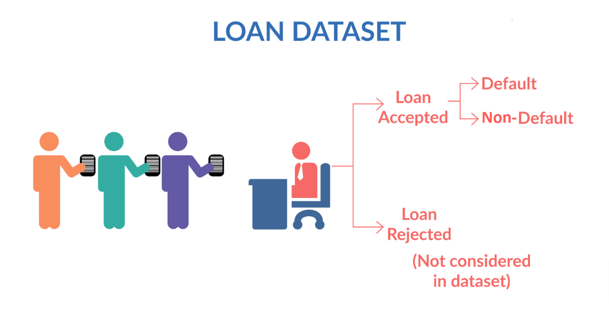

# Loan-Classification

----------

## Introduction

This project utilizes traditional machine learning models to predict loan approval decisions. A strong emphasis is placed on data quality and usability through comprehensive data cleaning and preprocessing, ensuring the removal of irrelevant or noisy features. Additionally, exploratory data analysis (EDA) is conducted to uncover underlying patterns, relationships, and trends within the dataset, providing valuable insights that inform model development.

## Goals and Objectives

### Goals:

Develop a predictive and interpretable machine learning model to assist banks in assessing the risk of potential loans and provide transparent, data-driven justifications to encourage investor confidence in lending decisions.

Key objectives:

    - Analyze: To understand the structure and patterns within the dataset.

    - Develop Predictive Models: That are robust and well-suited to predict the likelihood of loan approval for new applicants.

    - Evaluate Models: Compare and evaluate the performance of different models.

    - Select the Best Model: That is both practical for real-world deployment and highly interpretable.

## Dataset

<p align="center">
  <br/>
  <i>Model in Action</i>
</p>

## Dataset
<p align="center">
  <br/>
</p>


The dataset used in this project is from [Kaggle's Loan Classification Dataset](https://www.kaggle.com/datasets/abhishek14398/loan-dataset/data) and included in the `/data` directory. It consists of customers' details for acceptance/rejection of loans. The dataset contains 2 files:
- [loan.csv](https://github.com/phuongvu0206/Loan-Acceptance-Prediction/blob/main/data/loan.csv): Contains data used to analyze and train machine learning models.
- [Data_Dictionary.xlsx](https://github.com/phuongvu0206/Loan-Acceptance-Prediction/blob/main/data/Data_Dictionary.xlsx): Contains a data dictionary containing the columns with the feature name and their respective description for loan acceptance and rejection status.

## Requirements

Install the required Python libraries using pip:

```bash
pip install -r requirements.txt
```

## Deploying Model to Web Application

### Overview

This guide explains how to deploy and run a machine learning model using Streamlit. The deployment package contains a pre-trained model that predicts loan classifications and includes necessary preprocessing tools.

### Project Structure

Inside the `Demo` folder, you will find:

- `loan_classifier_model.pkl` – The pre-trained machine learning model used for prediction.
- `scaler.pkl` – A file containing the standard scaler used to normalize input data.
- `web_deploy.py` – A Streamlit application providing a user interface for model interaction.

### Deployment Instructions

Follow these steps to deploy the application:

#### 1. Open Terminal and Navigate to the Deployment Folder

```bash
cd "path/to/Demo"
```

Replace `"path/to/Demo"` with the actual path to your `Demo` directory.

#### 2. Run Streamlit

Start the application by running:

```bash
streamlit run deploy.py
```

If successful, your terminal will display a local URL where you can view the app in your browser.

#### 3. Fix File Path Errors (If Any)

If you encounter errors related to loading `.pkl` files, update the file paths of `loan_classifier_model.pkl` and `scaler.pkl` in function `load_model_and_scaler()` to their absolute paths if needed.

**Example:**

Replace:
```python
open("loan_classifier_model.pkl", "rb")
```

With:
```python
open("C:/Users/your_path/web_deployment/loan_classifier_model.pkl", "rb")
```

### 4. Restart the Application

After correcting the file paths, re-run the app:

```bash
streamlit run deploy.py
```

Ensure all `.pkl` files are located in the correct folder and paths are set properly.

## Application Interface

Once the application is running, the user interface will be accessible via your browser. You can then input new loan application data and view the model's prediction directly from the interface.